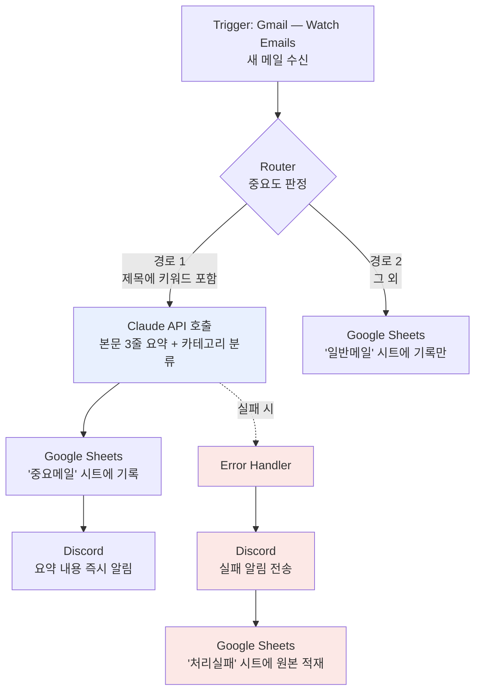

# [프로젝트 2] 자유 주제 자동화 — 메일 자동 분류 및 AI 요약 파이프라인

> 작성자: 황지영
> 작성일: 2026-07-__

> 🔧 `___` 는 구현 후 채워야 하는 항목입니다.
> 이 설계는 **보너스 과제 1(AI 연동)과 2(실패 알림·재시도)를 모두 포함**하도록 구성했습니다.

---

## 1. 자동화할 반복 업무 정의

### 현재의 수작업

매일 받은편지함에 도착하는 메일 중 업무 관련 메일을 골라내어,
내용을 읽고 핵심을 파악한 뒤, 관리 시트에 옮겨 적고 필요 시 팀에 공유하는 작업.

| 항목 | 내용 |
|---|---|
| 발생 빈도 | 하루 `___`회 |
| 1회 소요 시간 | 약 `___`분 |
| 일일 누적 | 약 `___`분 |
| 월 환산 | 약 `___`시간 |

### 이 업무가 자동화에 적합한 이유

1. **트리거가 명확하다** — "메일 수신"이라는 외부 이벤트로 시작된다
2. **판단 기준을 규칙화할 수 있다** — 발신자·제목 키워드로 중요도 분류 가능
3. **결과물의 형태가 일정하다** — 매번 같은 항목을 같은 시트에 기록한다
4. **반복 횟수가 많다** — 자동화 구축 비용을 회수할 만큼 자주 발생한다

> 💡 이 4가지가 "자동화 가능 여부 판단 기준"입니다. 과제 목표의
> *"반복 업무를 분석해 자동화 가능 여부를 판단"* 항목에 대응합니다.

---

## 2. 도구 선정 및 근거

### 선정: **Make**

| 선정 기준 | 판단 |
|---|---|
| 비용 | 무료 플랜에서 필요한 모든 기능(Router, HTTP, 에러 핸들링) 제공 |
| 분기 처리 | Router로 단일 시나리오 내 다중 분기 관리 가능 |
| AI 연동 | HTTP 모듈로 Claude API 직접 호출 가능 (전용 커넥터 불필요) |
| 오류 처리 | **Error handler** 경로를 모듈 단위로 설계 가능 — 보너스 2 구현에 필수 |
| 프로젝트 1 경험 | 이미 Google 계정 연동이 완료되어 재사용 가능 |

### 탈락 사유

- **Zapier**: 프로젝트 1에서 확인했듯 무료 플랜이 2단계로 제한되며, 체험 기간(14일) 종료 후 지속 운영이 불가능하다. 개인이 계속 쓸 자동화로는 부적합하다.
- **n8n(자가호스팅)**: 기능적으로는 가장 자유롭지만, 24시간 실행을 위해 서버를 상시 가동해야 하는 운영 부담이 있다.

---

## 3. 워크플로우 설계



### 단계별 설명

| # | 단계 | 유형 | 설명 |
|---|---|---|---|
| 1 | Gmail — Watch Emails | **Trigger** | 받은편지함에 새 메일이 도착하면 시나리오 시작 |
| 2 | Router | **분기** | 제목/발신자 기준으로 중요 메일과 일반 메일을 분리 |
| 3 | HTTP — Claude API | **Action (AI)** | 본문을 3줄로 요약하고 카테고리를 자동 분류 |
| 4 | Google Sheets — Add a Row | **Action** | 요약 결과를 시트에 축적 |
| 5 | HTTP — Discord Webhook | **Action** | 요약본을 즉시 알림으로 전달 |
| E | Error Handler | **예외 처리** | AI 호출 실패 시 알림 + 원본 보존 |

### 요구사항 충족 확인

- [x] Trigger 1개 이상 — Gmail Watch Emails
- [x] Action 2개 이상 — Claude 요약 / Sheets 기록 / Discord 알림 (3개)
- [x] 조건 분기 1개 이상 — Router 2경로
- [x] Trigger 발생 시 **자동 실행** — 폴링 방식으로 상시 대기
- [x] 보너스 1 — 생성형 AI를 Action으로 연동
- [x] 보너스 2 — 실패 알림 + 대체 경로(원본 적재)

---

## 4. 분기 조건 상세

| 경로 | 조건 | 처리 |
|---|---|---|
| **경로 1 — 중요** | 제목에 `계약`, `긴급`, `승인`, `마감` 중 하나 포함<br/>**또는** 발신자가 지정 도메인 | AI 요약 → 시트 기록 → 즉시 알림 |
| **경로 2 — 일반** | 그 외 전부 | 시트 기록만 (알림 없음) |

**설계 의도:** 모든 메일에 알림을 보내면 알림 자체가 소음이 되어 자동화의 목적을 잃는다.
또한 AI 호출은 비용이 발생하므로 **중요 메일에만 선택적으로 적용**해 실행 비용을 통제한다.

> 이것이 조건 분기의 실질적 역할이다 — 단순히 갈래를 나누는 것이 아니라
> **비용과 주의력이라는 유한한 자원을 배분**하는 장치다.

---

## 5. Claude API 연동 설정 (보너스 1)

Make의 **HTTP — Make a request** 모듈 설정:

| 항목 | 값 |
|---|---|
| URL | `https://api.anthropic.com/v1/messages` |
| Method | `POST` |
| Headers | `x-api-key`: `{{API키}}`<br/>`anthropic-version`: `2023-06-01`<br/>`content-type`: `application/json` |
| Body type | Raw (JSON) |

**요청 본문:**

```json
{
  "model": "claude-sonnet-5",
  "max_tokens": 500,
  "messages": [
    {
      "role": "user",
      "content": "다음 이메일을 처리해줘.\n\n1) 핵심 내용을 3줄로 요약\n2) 카테고리 분류: [계약/문의/공지/기타] 중 하나\n3) 대응 필요 여부: [필요/불필요]\n\n형식은 반드시 아래를 지켜줘.\n요약:\n- \n- \n- \n카테고리: \n대응필요: \n\n---\n제목: {{1.subject}}\n본문: {{1.text}}"
    }
  ]
}
```

**응답에서 값 꺼내기:** `{{5.data.content[1].text}}`
*(모듈 번호는 실제 시나리오에 맞게 조정)*

> ⚠️ **`content[1]`의 `1`은 오타가 아니다.**
> Make의 표현식은 배열 인덱스가 **1부터** 시작한다. 일반적인 프로그래밍 감각으로
> `[0]`으로 고치면 값이 안 나온다. 건드리지 말 것.
>
> 다만 `content`는 **블록 배열**이라 첫 블록이 항상 텍스트라는 보장은 없다.
> 응답 형태가 바뀌면 이 인덱스가 조용히 빈 값을 물어올 수 있으므로,
> 요약이 갑자기 공란으로 들어오면 여기를 먼저 의심할 것.

> ⚠️ **보안 필수사항**
> - API 키는 Make의 **Connections** 또는 시나리오 변수에 저장하고, 모듈에 직접 입력하지 않는다
> - 캡처 시 키가 보이면 반드시 `sk-ant-***` 형태로 마스킹한다
> - 과제 제약사항에 민감정보 노출 금지가 명시돼 있다

---

## 6. 실패 알림 및 재시도 전략 (보너스 2)

### 왜 필요한가

AI API 호출은 네트워크 오류, 레이트 리밋, 응답 지연 등으로 **실패할 수 있는 지점**이다.
예외 처리가 없으면 시나리오가 중단되고, **그 메일은 어디에도 기록되지 않은 채 유실**된다.

자동화의 신뢰성은 "잘 돌아갈 때"가 아니라 **"실패했을 때 무슨 일이 일어나는가"**로 결정된다.

### 설계

Make에서 Claude API 모듈을 우클릭 → **Add error handler** 로 예외 경로를 추가한다.

| 전략 | 구현 | 목적 |
|---|---|---|
| **1차: 재시도** | Error handler에 **Break** 지시자 배치<br/>재시도 3회 / 간격 15분 | 일시적 네트워크 오류·레이트 리밋 자동 복구 |
| **2차: 실패 알림** | Discord 웹훅으로 즉시 통보<br/>(메일 제목 + 오류 메시지 포함) | 사람이 인지할 수 있게 함 |
| **3차: 대체 경로** | `처리실패` 시트에 **원본 메일 전문** 적재 | AI 요약에 실패해도 **데이터 자체는 보존** |

**실패 알림 메시지 형식:**

```json
{"content": "⚠️ **자동화 실패**\n대상: {{1.subject}}\n단계: Claude API 호출\n오류: {{error.message}}\n→ 원본은 '처리실패' 시트에 보관됨"}
```

### 검증 방법

- [ ] API 키를 일부러 잘못된 값으로 바꾼다
- [ ] 시나리오를 실행한다
- [ ] Discord에 실패 알림이 오는지 확인
- [ ] `처리실패` 시트에 원본이 적재됐는지 확인
- [ ] API 키를 원복한다

📸 **캡처** → `captures/make/05-실패알림.png`

> 이 검증까지 캡처해두면 보너스 2의 근거가 명확해집니다.

---

## 7. 구현 결과

### 실행 기록

| 항목 | 값 |
|---|---|
| 총 실행 횟수 | `___`회 |
| 경로 1(중요) 실행 | `___`회 |
| 경로 2(일반) 실행 | `___`회 |
| 실패 처리 테스트 | `___`회 |
| 평균 처리 시간 | `___`초 |

### 자동화 효과

| | 자동화 전 | 자동화 후 |
|---|---|---|
| 1건당 소요 시간 | `___`분 | `___`초 |
| 일일 소요 시간 | `___`분 | 0분 (무인) |
| 월 절감 시간 | — | 약 `___`시간 |

### 첨부 캡처

| 파일 | 내용 |
|---|---|
| `captures/make/04-프로젝트2-시나리오.png` | 전체 워크플로우 구조 |
| `captures/make/05-실패알림.png` | 오류 처리 동작 확인 |
| `captures/make/06-실행이력.png` | 양쪽 경로 실행 기록 |
| `captures/sheets/02-요약결과.png` | AI 요약이 기록된 시트 |
| `captures/discord/02-요약알림.png` | 요약 알림 수신 |

---

## 8. 한계 및 개선 방향

### 현재 설계의 한계

- **15분 폴링 간격** — 무료 플랜 제약으로 실시간 알림은 불가능하다. 진짜 즉시성이 필요하다면 Gmail Push Notification(Pub/Sub) 기반 Webhook 트리거로 전환해야 한다.
- **키워드 기반 분기** — 규칙이 단순해 오분류 가능성이 있다. 분류 자체를 AI에게 맡기면 정확도가 오르지만, 그만큼 AI 호출 비용이 전체 메일로 확대된다. **정확도와 비용의 트레이드오프**다.
- **월 1,000 credits 제한** — 메일 수신량이 많으면 무료 범위를 초과한다.

### 배운 점

- **Trigger와 Action의 개념**: `___`
- **조건 분기의 역할**: `___`
- **자동화 설계 시 가장 중요하다고 느낀 것**: `___`

> 💡 마지막 항목은 평가에서 비중이 큽니다.
> "돌아가게 만드는 것"과 "실패해도 데이터를 잃지 않게 만드는 것"의 차이를 겪은 대로 쓰시면 좋습니다.
